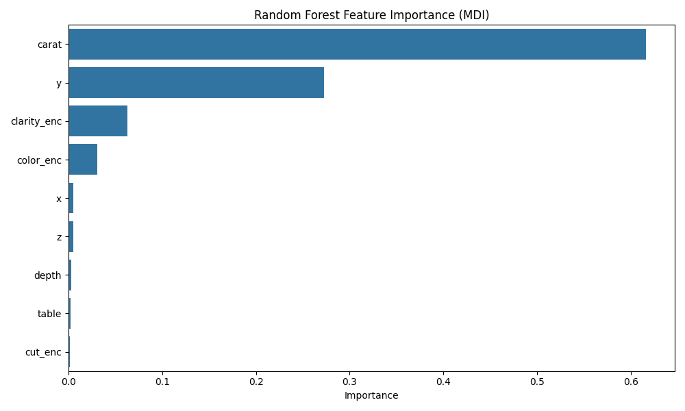
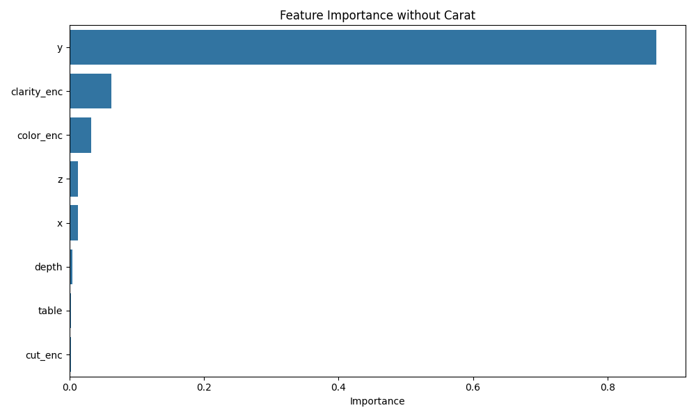
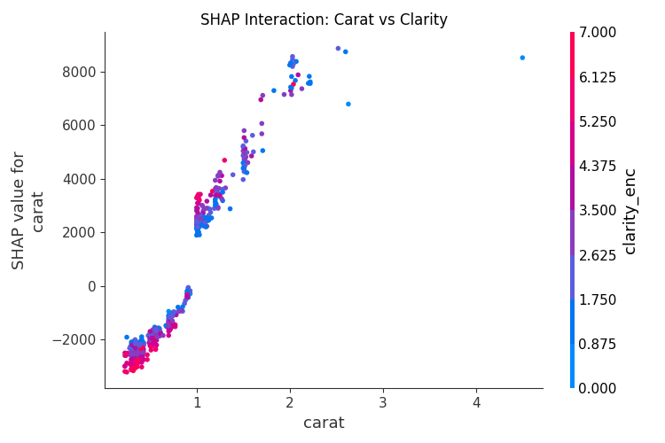
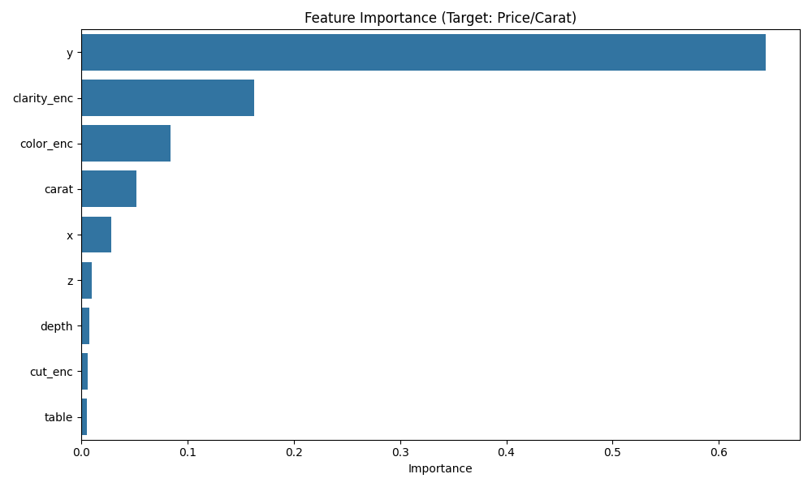
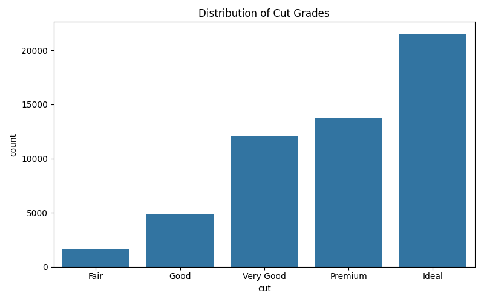

# 1. はじめに
本レポートでは、diamonds データセットを用いて、ダイヤモンド価格を予測する回帰モデルを構築し、その性能評価および価格決定に寄与する変数の分析を行った。本分析では、Rのggplot2に含まれる diamonds データを、Python環境では seaborn-dataから取得して用いた[1]。
具体的には、Random Forest Regressor を用いた価格予測モデルを構築し、変数重要度および SHAP値（各特徴量の予測値への平均寄与度） により、価格形成の背後にある市場評価構造を解釈した。また、評価の堅牢性を確認するため、通常のランダム分割に加えて Carat 帯による Group Split 検証 を実施し、特定のカラット帯への過学習を回避した性能評価を行った。
さらに、市場で広く知られる 0.99 カラットと 1.00 カラットの価格断絶 について、物理寸法を整合させたシミュレーションにより定量的検証を行った。

# 2. 実験設定
## 2.1 データセット

**表1：diamonds データセットにおける特徴量の分類と役割**

| カテゴリ | 変数 | 型 | 役割/補足 |
| --- | --- | --- | --- |
| サイズ | carat, x, y, z | 数値 | サイズを表す主要因。carat とx, y, zは強い相関 |
| 品質 | clarity, color | カテゴリ | 品質評価。ベース価格に対する増幅要因として解釈 |
| 加工品質 | cut | カテゴリ | カット品質。一定水準以上が前提となりやすい |

## 2.2 前処理および分割方法
学習および評価は、以下の2通りの分割方法で実施した。

**表2：学習・評価に用いたデータ分割方法の比較**

| 分割方法 | 分割基準 | 目的 | 特徴・注意点 |
| --- | --- | --- | --- |
| ランダム分割 | 全データをランダムに分割 | モデルの基本性能評価 | サイズ帯の情報漏洩が起きやすく、楽観的評価になりやすい |
| Carat帯 Group Split | Carat を 0.05ct 刻みでグルーピング | 価格決定構造の汎化性能検証 | 同一カラット帯が学習・評価に跨らず、暗記による過大評価を抑制 |

## 2.3 使用モデル
本実験ではRandom Forest Regressorを使用した。

# 3. 実験結果
## 3.1 モデル性能評価
構築したRandom Forest回帰モデルの性能を以下に示す。

**表3：Random Forest 回帰モデルの価格予測性能指標**

| 指標 | 値 |
| --- | --- |
| 決定係数 ($R^2$) | 0.9816 |
| MAE | $266.57 |
| 平均誤差率 | 約 6.8% |

ランダム分割に加え、Carat帯Group Split検証においても 平均 $R^2$ = 0.9676を維持した。
この結果から、本モデルは個体の暗記ではなく、サイズおよび品質に基づく価格決定ロジックを学習していると判断できる。

# 4. 変数重要度の比較と考察
## 4.1 ベースライン分析：変数重要度
Random Forestの変数重要度を確認した結果、Carat（63.3%）および y（25.5%）で全体の約90% を占めた。

**図1：Random Forestによる変数重要度（ベースライン）**

この結果は、価格がまずサイズに強く規定されていることを示している。
y の重要度が高い理由は、幅そのものの重要性というより、carat と組み合わさり サイズ感を多面的に表現する代理変数 として機能しているためと解釈できる。

## 4.2 SHAPによる詳細解析
### 4.2.1 サイズ冗長性の検証
carat を説明変数から除外して再学習を行った結果、性能は $R^2 = 0.9806$ と、わずか0.001の低下に留まった。

**図2：Carat除外後の変数重要度**

この結果は、サイズ情報がx, y, zに冗長に含まれているため、carat が欠落しても寸法特徴量が代替したことを示す。同時に、市場が重さそのものではなく 見た目のサイズ感を重視している可能性とも整合的である。

### 4.2.2 品質の増幅効果
carat と clarity の相互作用をSHAP Interactionで分析した。

**図3：Carat × Clarity のSHAP相互作用プロット**

同一のCaratにおいても、Clarityが良い個体ほど 重量増加に対する価格へのSHAP値が大きくなる傾向が一貫して観測された。これは、品質が単なる加算要素ではなく、ベース価格に対する乗数として機能していることを示唆する。

### 4.2.3 単価モデルによる品質要因の再評価
目的変数を price / carat に変更して学習を行った結果、clarity および color の重要度が合計約25%まで上昇した。

**図4：単価モデルの変数重要度**

価格全体ではサイズが支配的に見える一方、単価の観点では品質要因が強く効く ことが確認された。

### 4.2.4 閾値効果の検証
他の特徴量を代表値に固定し、x,y,zを carat と物理的に整合するようスケーリングした状態で、0.99ctと1.00ctの予測価格を比較した。

**表4：0.99ct と 1.00ct における予測価格の比較（Magic Number 検証）**

| Weight | Predicted Price | Note |
| --- | --- | --- |
| 0.99 ct | $4,835 | 物理的に縮小 |
| 1.00 ct | $6,067 | 市場中心値 |
| 差分 | +$1,232（+25.5%） | |

わずか1%の重量差に対して約25%の価格差が生じており、1カラットという離散的ラベルに対するプレミアムの存在が定量的に確認された。

### 4.2.5 Cut が効かない理由
Cutの重要度が低い背景を確認したところ、データの約87%が「Very Good」以上に集中していた。

**図5：Cutグレードの分布**

この結果から、Cutは差別化要因ではなく、市場参加のための最低条件として機能している可能性が高い。

# 5. 評価プロトコルの堅牢性
Carat帯Group Split検証においても、モデルは 平均 $R^2$ = 0.9676を維持した。
これは、Magic Numberや品質Multiplierといった価格形成構造が、特定サイズ帯に依存しない一般的傾向である可能性を示している。

# 6. 結論
本分析の結果、ダイヤモンド価格は三層構造によって形成されていると整理できる。まず前提条件として、Cut が一定水準以上であることが求められる。その上で、サイズやいわゆる Magic Number が価格の基準となるベースラインを決定し、最後に Clarity や Color などの品質要因が、そのベース価格を増幅する役割を果たしている。以上より、ダイヤモンドの価格形成は、単なる物理的特性の反映にとどまらず、市場心理と品質評価が複合的に作用した結果であることが示唆された。

# 7. 本分析の限界と今後の課題
本分析はdiamonds データセット固有の分布特性に依存しているため、得られた知見を実市場全体へそのまま外挿する際には注意が必要である。また、カラットや寸法などのサイズ関連変数の間にはいわば共線性が存在しており、その結果として特徴量重要度の割り当てはモデルや表現方法に依存して変動し得るという制約がある。今後の課題としては、Boosting 系モデルや線形モデルとの比較分析を行うことで、解釈結果の一貫性や頑健性を検証する余地があると考えられる。

# 8. 参考文献
[1] seaborn-data/diamonds: Diamonds dataset (version 1.0.0) (https://github.com/seaborn-data/diamonds)
